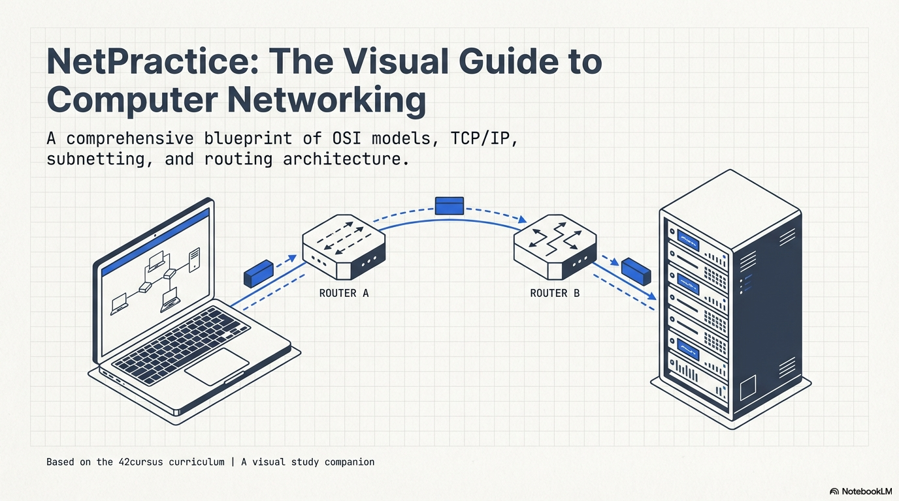
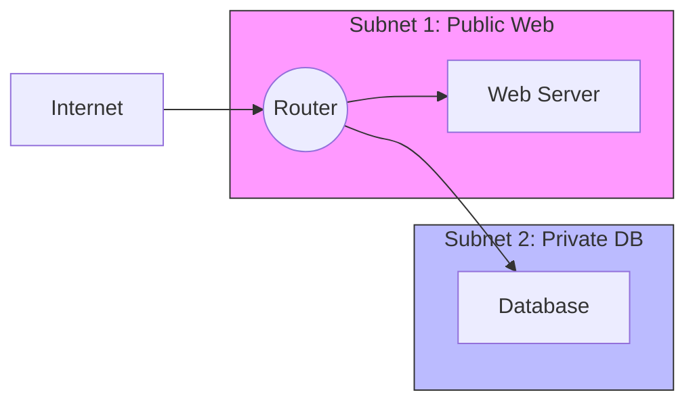
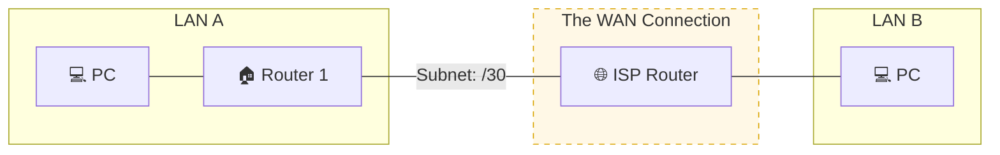

# 🌐 NetPractice: The Networking Blueprint

A technical guide to mastering Layer 3 networking, subnetting, and routing. This repository contains the logic and strategies needed to navigate the challenges of the 42 NetPractice project.

    
    

  

## 🏙️ **The "Digital City" Analogy**

To understand networking, stop thinking about numbers and start thinking about architecture:

* **IP Address:** Your house address in the city.

* **Subnet Mask:** The "Zoning Law" that decides how big your neighborhood is.

* **Router:** The "Traffic Cop" 🚦 standing at the intersection of two neighborhoods.

* **Switch:** The "Community Hall" where everyone inside the same neighborhood meets.

* **Default Gateway:** The "Main Exit" out of your neighborhood to the rest of the world.

## 🛠️ Core Concepts Simplified

### **1. Subnetting: Slicing the Pizza** 🍕

A large network is like a giant pizza. Subnetting is how we slice it so different teams (web servers, databases, users) don't get in each other's way.

### **2. The TCP/IP Handshake: The Formal Intro**

Before data moves, computers perform a "**Three-Way Handshake.**" It’s like a polite phone call:

**SYN:** "Hey, can you hear me?"

**SYN-ACK:** "Yes! I can hear you, can you hear me?"

**ACK:** "Perfect, let's talk."

### 🌎 **3. WAN Technologies — Connecting the World**

In the first few levels of NetPractice, you work within a **LAN (Local Area Network)**. But as you progress to Level 6 and beyond, you start interacting with the Internet, which is the ultimate **WAN (Wide Area Network)**.

#### **The Concept: Private Highways vs. Public Tunnels**

Imagine you need to send a secure package from your office in Khouribga to a branch in Rabat. You have two main ways to do it:

* **Private WAN (MPLS/Direct Link):** You build your own private, dedicated road between the two cities.

  * **Pros:** It’s incredibly fast and secure; no one else can use it.

  * **Cons:** It’s very expensive and hard to build.

* **Public WAN with VPN:** You use the existing public highway, but you put your package in an armored, encrypted truck.

  * **Pros:** Much cheaper and uses existing infrastructure.

  * **Cons:** If the public highway is crowded (traffic/latency), your package might slow down.

#### **🏗️ WAN Design in NetPractice**

When you see a router connecting to the "Internet" in the project, you are dealing with a **Point-to-Point link**.

#### **The /30 Subnet Trick**
In WAN technology, we often use a ** /30 mask** for the link between two routers.

* **Why?** A /30 provides exactly 4 IP addresses.

* **The Breakdown:** * 1 for the Network ID.

  * 1 for the Broadcast address.

  * **Only 2 usable IPs:** One for the "Home" router and one for the "ISP/Internet" router.

* **Result:** Zero wasted addresses. This is the gold standard for router-to-router connections.

